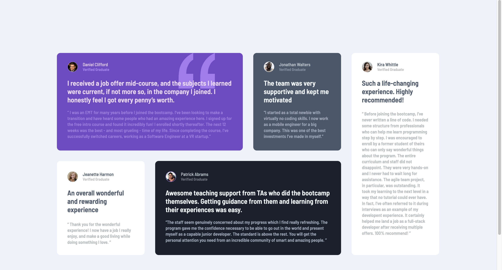

# Frontend Mentor - Testimonials grid section solution

This is a solution to the [Testimonials grid section challenge on Frontend Mentor](https://www.frontendmentor.io/challenges/testimonials-grid-section-Nnw6J7Un7). Frontend Mentor challenges help you improve your coding skills by building realistic projects. 

## Table of contents

- [Overview](#overview)
  - [The challenge](#the-challenge)
  - [Screenshot](#screenshot)
  - [Links](#links)
- [My process](#my-process)
  - [Built with](#built-with)
  - [What I learned](#what-i-learned)
  - [Continued development](#continued-development)
- [Author](#author)


## Overview

### The challenge

Users should be able to:

- View the optimal layout for the site depending on their device's screen size

### Screenshot



### Links

- Solution URL: [My Solution!](https://www.frontendmentor.io/solutions/testimonial-grid-section-NE5RWokJjV)
- Live Site URL: [Live Site!](https://clipzorama.github.io/Testimonial-Grid-Section/)

## My process

### Built with

- Semantic HTML5 markup
- CSS custom properties
- CSS Grid
- Responsive Design with Media Queries


### What I learned

- Improved my understanding of responsiveness using media queries.
- Practiced styling different types of text content and image elements, ensuring consistency and alignment.
- Enhanced my ability to manipulate fonts and colors to create an engaging design.
- Gained confidence in organizing content dynamically with grid columns and rows.


```html

<div class="testimonial-header">
  
  <div class="user-info">
      <h4 class="dan">Daniel Clifford</h4>
      <p>Verified Graduate</p>
  </div>
</div>

```

```css

.grid-container {
    margin: 155px 165px;
    display: grid;
    grid-template-columns: repeat(4, 1fr);
    grid-template-rows: 280px 270px;
    gap: 30px;
}

.clifford {
    position: relative;
    grid-column: 1 / 3;
    grid-row: 1 / 2;
    background-color: var(--Moderate-violet);
    border-radius: 10px;
    box-sizing: border-box;
    padding: 25px 30px;
    z-index: 5;

}

```

### Continued development

- Add hover and interactive animations to enhance user engagement.
- Integrate JavaScript to dynamically load testimonials from an API or JSON file.
- Improve accessibility features such as better contrast for text, adding ARIA labels, and ensuring semantic HTML structure.
- Optimize images and explore lazy loading techniques for better performance on low-bandwidth devices.

## Author

- Frontend Mentor - [@Clipzorama](https://www.frontendmentor.io/profile/Clipzorama)

